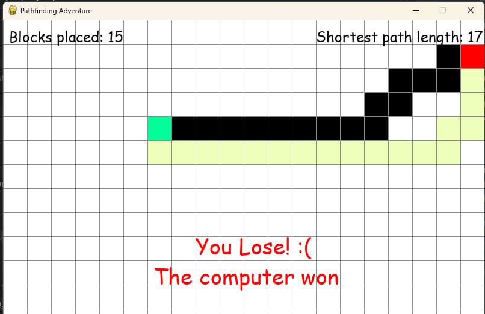

# Programmieren im Mathematikunterricht - Projekt

Dies ist das GitHub-Repository für die Implementierung des Projekts für das Fach "Programmieren im Mathematikunterricht"! Implementiert wurde ein kleines Spiel, bei der ein Spieler den kürzesten Pfad zwischen zwei Punkten finden muss. 

## Ersteller
- Manfred Trauner
- Philip Hallwirth
- Jasmin Kropshofer

## Spielprinzip
Der Spieler sieht ein Feld mit 20x20 Blöcken. Zwei dieser Blöcke sind gefärbt, einer grün und der andere rot. Diese Felder markieren den Start- und den Endpunkt. Das Ziel ist es, den kürzesten Weg zwischen Start- und Endpunkt zu finden, indem man per Mausklick Blöcke setzt. Dabei ist es nur erlaubt, nach rechts, links, oben und unten Blöcke zu setzen. Einen Weg diagonal setzen, ist also nicht zulässig.

## Todo
- Die Ausgabe, ob gewonnen/verloren wurde sollte noch schöner/ausführlicher gestaltet werden (also der Text; zB "Congratulations! You found the shortest path and beat the computer" und vll wieder ein Emoji oder so)
- vll unnötige komplizierte Sachen einfacher gestalten
- vll im README ein paar Bilder einfügen vom Game-Verlauf so als Beispiele
- Optional bzw. to be dicussed: Erweiterung durch mehrere Knoten, damit der Dijkstra auch wirklich Sinn hat

## Done
- Press R macht leider noch nichts, sollte das Feld neu laden und alles zurücksetzen.
- Ich bin mir noch unsicher, ob der Dijkstra 100% korrekt arbeitet --> dürfte noch nicht zu hundert prozent funktionieren: 
konnte allerdings noch kein Problem finden, es dürfte allerdings daran liegen, dass der Algorithmus am falschen Punkt beginnt -> geht jetzt, da der user input überschrieben wird

## Benötigte Module
Folgende Module müssen installiert werden, um das volle Spielerlebnis zu genießen:
- `pygame`
- `pygame_menu`
